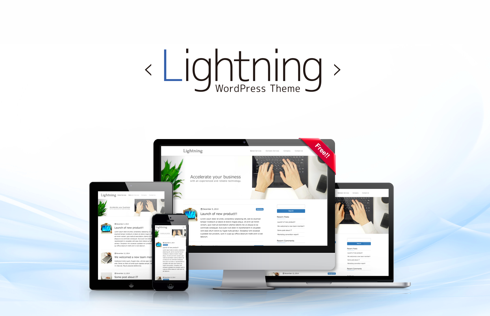
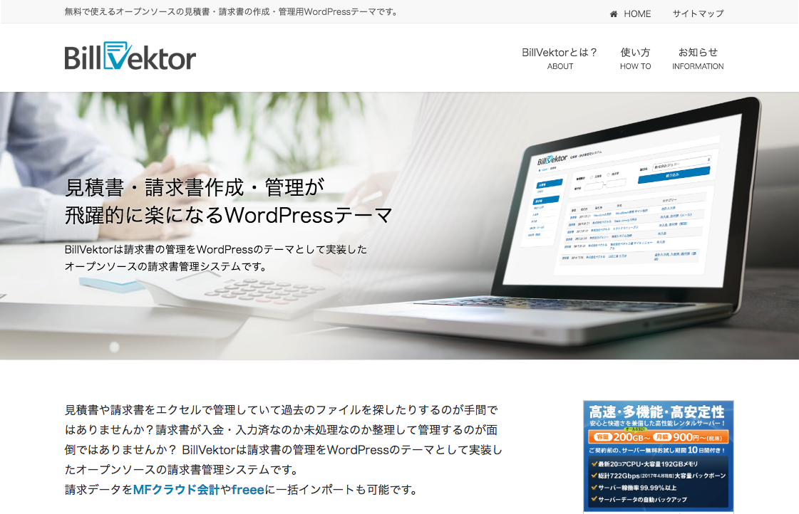
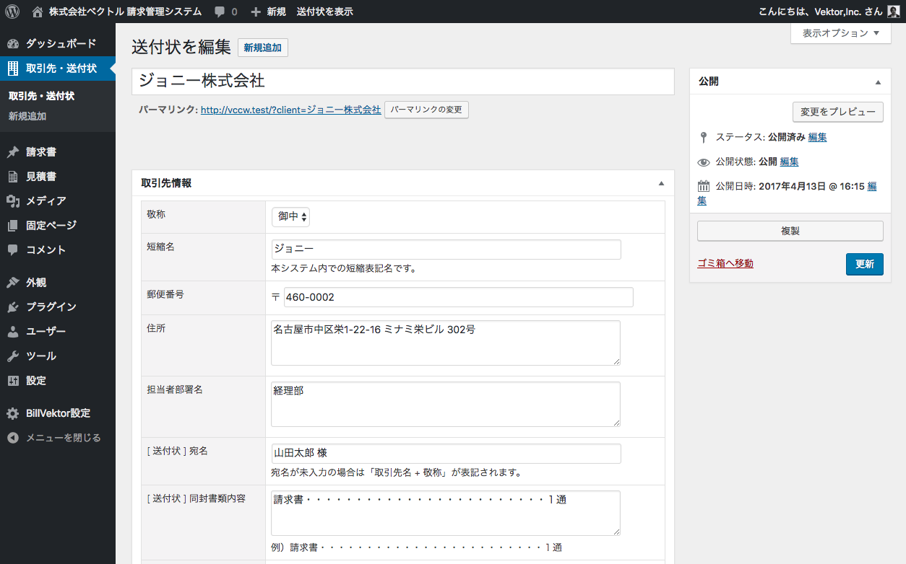
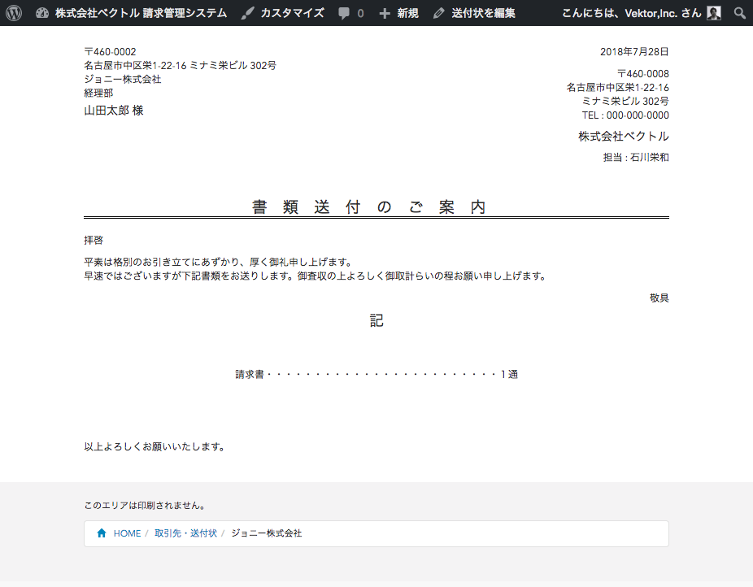
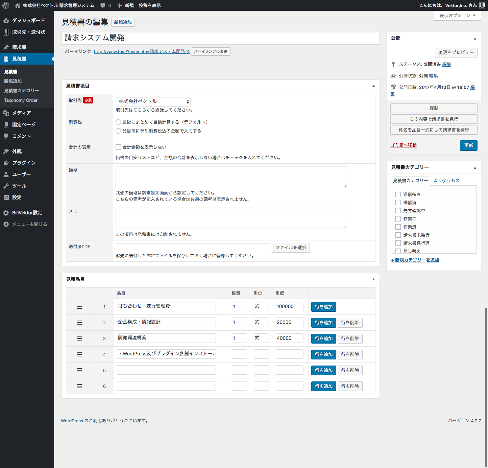
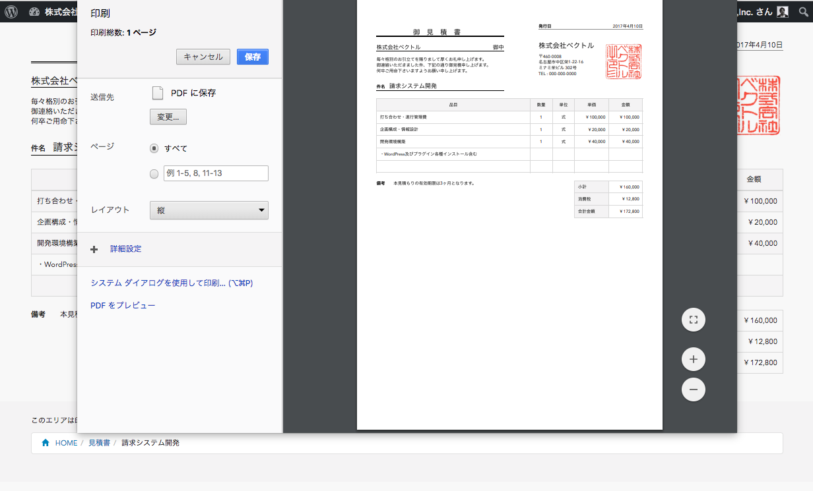
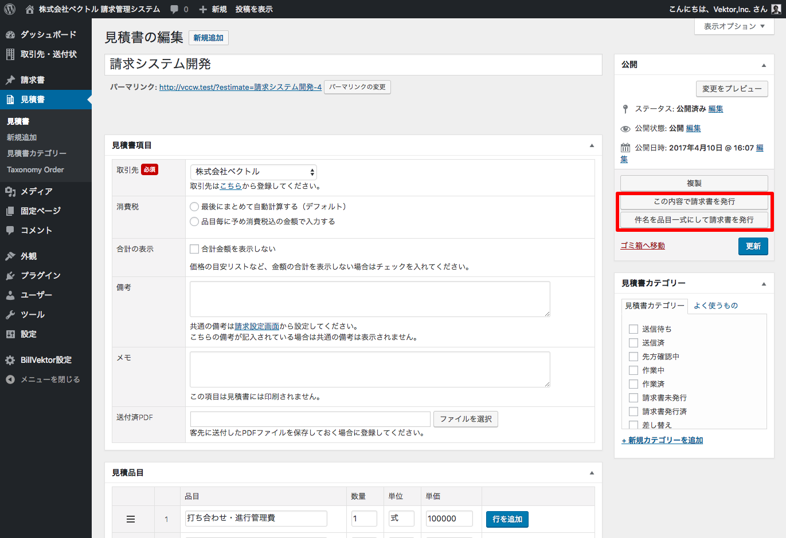
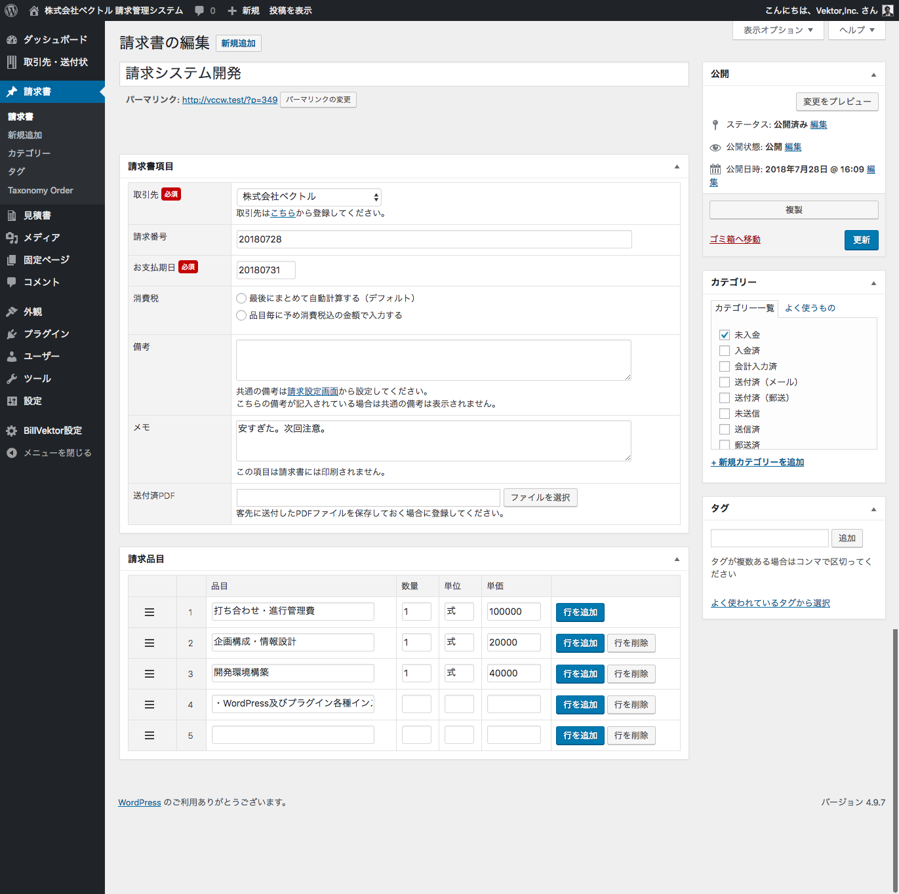
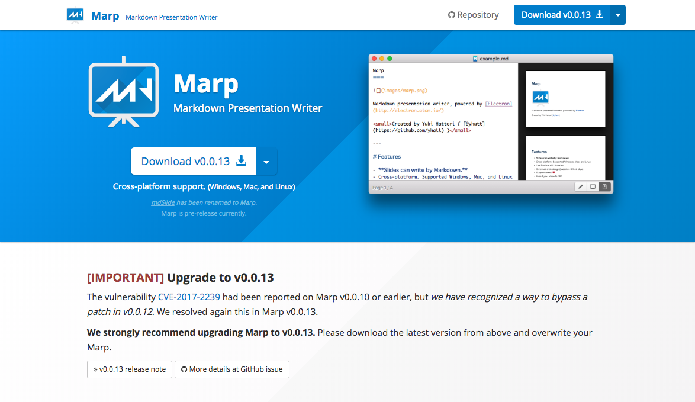

<!-- $theme: default -->
<link rel='stylesheet' href='themes/common/bootstrap/css/bootstrap.min.css' type='text/css' media='all' />
<link rel='stylesheet' href='themes/common/font-awesome/web-fonts-with-css/css/fontawesome-all.min.css' type='text/css' media='all' />
<link rel='stylesheet' href='themes/common/css/style.css' type='text/css' media='all' />
<link rel='stylesheet' href='themes/child/css/style.css' type='text/css' media='all' />

# いしかわの発表

Vektor,Inc.

<!-- page_number: true -->

---

## 自己紹介

 

<h3>石川栄和 @kurudrive</h3>

株式会社ベクトル
代表 / フロントエンドエンジニア

趣味 : スプラトゥーン / スケボー

 

---

## 今日の発表内容

### Lightning
ビジネス向け汎用WordPressテーマ

### BillVektor
見積書・請求書管理用 WordPressテーマ

### Marp<small>（作者は僕ではありません）</small>
おすすめスライド作成ツール

---

## Lightning

<i class="far fa-arrow-alt-circle-right"></i>https://lightning.nagoya/ja

---

 

---

## Lightning

<i class="far fa-arrow-alt-circle-right"></i><a href="https://demo-ja.lightning.nagoya/" target="_blank">デモサイト</a>

* ビジネスサイト向け汎用WordPressテーマ
* WordPress公式ディレクトリ登録済（無料）

---

## BillVektor

<i class="far fa-arrow-alt-circle-right"></i>https://billvektor.com

---

 

---

## 請求書の管理何でやってますか？

* エクセル？
* misoca？
* Free?

---

## エクセルやPDFで管理すると

* 見積書と請求書のファイルが別
* クライアント毎に別のファイル
* シートで別れてたり・・・

---

## 発行した請求書を

* 未入金 / 入金済
* 会計アプリに・・・　入力済 / 未入金 

---

＿人人人人人人人人＿

 ＞　管理が面倒　＜

 ￣Y^Y^Y^Y^Y^Y^Y￣

---

## 請求元の設定

 

---

## 取引先の登録

 

---

 

---

## 見積書の作成

 

---

ページを表示 <i class="fas fa-arrow-circle-right"></i>ブラウザから印刷 <i class="fas fa-arrow-circle-right"></i>PDFで保存

 

---

## 請求書の作成

見積書編集画面 → この内容で請求書を発行

 

---

見積もり内容が引き継がれる。
支払期日など入力して公開。

 

---

## Marp <small>（面識ない人のプロダクト）</small>

<i class="far fa-arrow-alt-circle-right"></i>https://yhatt.github.io/marp/

---

## Power Point や Key Note

#### 長所
細かいデザインや図形が書きやすい

#### 短所
文字の位置や大きさのズレなど調整したくなる！

<i class="fas fa-caret-down fa-3x"></i>

  
際限なく時間がかかる！

---

## Markdown記法のスライドツール

#### Deckset（Macアプリ）
* いいんだけど文字サイズの調整とかわからなかった
* Mac買い替えて...

#### Qiita スライド / Dropbox Paper
* PDFに変換して公開しにくい
* デザインの微調整ができない

---

## おすすめ Marp

 

---

## Marpの素敵なところ

* Markdownで書ける
* 無料
* 独自のCSSを読み込んで微調整出来る！
* FontAwesomeやBootstrap読み込めば
アイコンや装飾もある程度使える

---

# 
このスライドも Marpで作りました！

---

### 
このスライドのMarpのセット
  

<i class="far fa-arrow-alt-circle-right"></i> <a href="https://github.com/kurudrive/marp-template" target="_blank">https://github.com/kurudrive/marp-template</a>

---

# 
Thank you!
